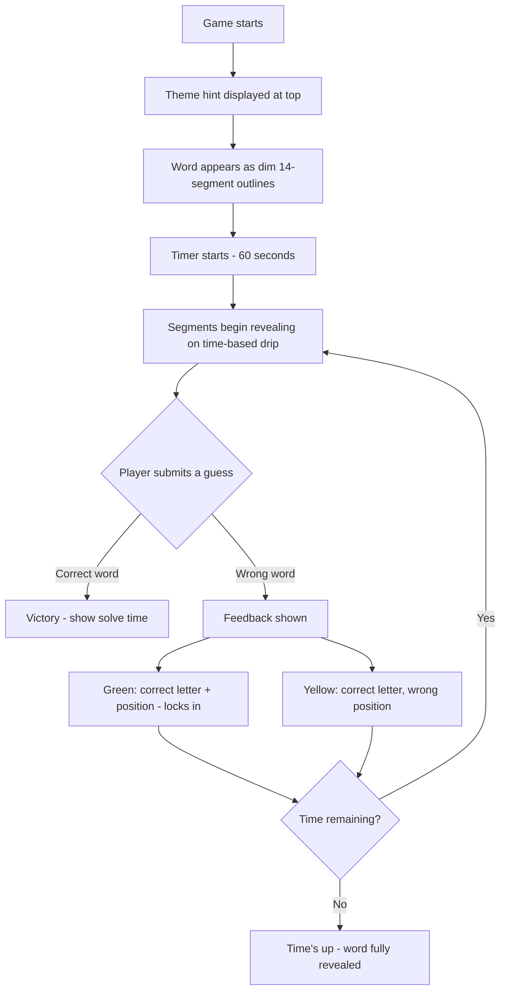

# Cap-Locks: 14-Segment Word Guessing Game

## Problem Frame

Word games dominate casual gaming (Wordle, Hangman) but the visual mechanics are stale — text on a grid. Cap-Locks introduces a novel reveal mechanic: words displayed as **14-segment LED characters** that gradually illuminate over time, creating a visual decoding challenge layered on top of word guessing. The retro hardware aesthetic (warm amber LEDs, vintage instrument panel) gives it a distinctive identity.

The full vision is a **live multiplayer elimination game** (think HQ Trivia meets Wordle), but V1 focuses on nailing the single-player core loop before adding multiplayer infrastructure.

## User Flow

## Requirements

**Display and Rendering**

- R1. Each character position renders as a 14-segment LED display capable of showing A-Z and 0-9
- R2. Unguessed characters show as dim/off segment outlines so players can count word length
- R3. Segments illuminate progressively on a fixed time-based drip over the round duration
- R4. The drip pacing should reveal enough to tease early but not make the word fully readable until late in the timer
- R5. Correctly guessed letters (green) display as fully illuminated in a distinct green color, locked in place
- R6. Visual style: retro hardware aesthetic — warm amber/red LED glow on dark background, vintage instrument panel feel (inspired by old digital test equipment)

**Guessing and Feedback**

- R7. Player submits full-word guesses via text input (case-insensitive; input normalized to uppercase)
- R8. Unlimited guesses allowed within the round timer
- R9. Green feedback: letter is correct and in the correct position — character locks in fully lit, green color
- R10. Yellow feedback: letter is in the word but in the wrong position (exact UI placement to be determined in planning)
- R11. No feedback for letters not in the word (standard behavior)
- R11a. Duplicate letter handling: green matches are assigned first; remaining unmatched instances receive yellow only if additional unmatched instances exist in the target word; excess duplicates receive no feedback
- R12. Previously guessed letters/words should be visible so the player doesn't repeat guesses

**Round Structure**

- R13. Each round features one word with a theme/category hint displayed at the top (e.g., "Animals", "80s Movies")
- R14. Round timer is 60 seconds
- R15. The curated word list should include words of varying length (difficulty tiers and round sequencing are deferred to V2)
- R16. When time expires, the full word is revealed with an animation

**Scoring**

- R17. Track solve time (how quickly the player guessed correctly)
- R18. Track number of guesses used
- R19. Display results at round end — solve time, guess count, and the revealed word

**Input Validation**

- R20. Guesses must match the target word length; incorrect-length guesses are rejected with a brief visual indicator and do not count as a guess

## Success Criteria

- The 14-segment reveal mechanic feels novel and satisfying — watching segments light up creates genuine tension and "aha" moments
- The core loop (see segments, guess, get feedback, see more segments) is engaging enough to replay multiple times
- The retro hardware aesthetic is visually distinctive and polished
- A player can complete a round in under 2 minutes including load time

## Scope Boundaries

**V1 includes:**
- Single-player, one word at a time
- Core game loop with all display, guessing, and feedback mechanics
- A curated set of words with theme hints (can be hardcoded for V1)
- Responsive web design (playable on mobile and desktop)
- Next.js deployed on Vercel

**V1 excludes (deferred to V2+):**
- Live multiplayer / simultaneous play
- Elimination rounds (top 10% advance)
- Player accounts or persistent profiles
- Leaderboards
- Anti-cheat / synchronization infrastructure
- 100K concurrent player scaling
- Word database or CMS — hardcoded word list is fine for V1
- Social sharing of results

## Key Decisions

- **14-segment (not 7-segment) display**: 7-segment can only show digits. 14-segment renders full alphabet, which is required for word guessing
- **Time-based segment drip (not guess-triggered)**: Fair for multiplayer (everyone sees the same thing at the same time), creates shared dramatic moments, simpler to synchronize
- **Full word guesses with letter feedback (not letter-by-letter)**: Creates Wordle-style commitment tension while rewarding partial knowledge through green/yellow feedback
- **Green + yellow feedback (not just green)**: Yellow (right letter, wrong position) gives players enough signal to iterate quickly within the time pressure
- **V1 as single-player**: Nail the core feel before tackling multiplayer infrastructure. The game mechanic must be fun solo before it can carry a live elimination format
- **Next.js on Vercel**: User-specified tech stack. Good fit for a web game — SSR for initial load, client-side for game interaction, Vercel for easy deployment

## Dependencies / Assumptions

- A 14-segment font or SVG/Canvas rendering approach exists or can be built for the web (likely custom SVG segments with individual opacity/color control)
- A curated word list with theme categories can be assembled for V1 (50-100 words across several themes is sufficient to validate the mechanic)

## Outstanding Questions

### Deferred to Planning

- [Affects R1][Technical] Best rendering approach for 14-segment displays — SVG with individual segment paths vs. Canvas vs. CSS-only approach
- [Affects R3][Needs research] Optimal segment reveal pacing — how many of 14 segments to show at each time interval to create the right tension curve
- [Affects R4][Needs research] Should the drip be linear (even spacing) or accelerating (slow start, faster reveal toward end)?
- [Affects R10][Technical] How to display yellow feedback — on the input area, on the display itself, or both?
- [Affects R12][Technical] UI for guess history — inline below the display, sidebar, or collapsible?
- [Affects R15][Needs research] Specific word length ranges per difficulty tier
- [Affects R6][Needs research] Reference implementations or libraries for retro LED aesthetics (glow effects, scanlines, etc.)

## V2 Vision (Context for Planning)

The full product vision is a **live elimination game**:
- All players start the same word at the same time
- 60-second timer, unlimited guesses, same segment drip for everyone
- Didn't solve in time = eliminated
- Solved it = time recorded; top 10% fastest advance to next round with a new (harder) word
- Rounds continue until a final winner or small winning group
- Target scale: 100K concurrent players
- Requires: real-time sync, anti-cheat, server-authoritative game state, scalable infrastructure

V1 architecture decisions that happen to be compatible with V2 are welcome; no V2-specific abstractions (real-time sync, server-authoritative state, anti-cheat hooks, scalability infrastructure) should be introduced in V1.

## Next Steps

-> `/ce:plan` for structured implementation planning
