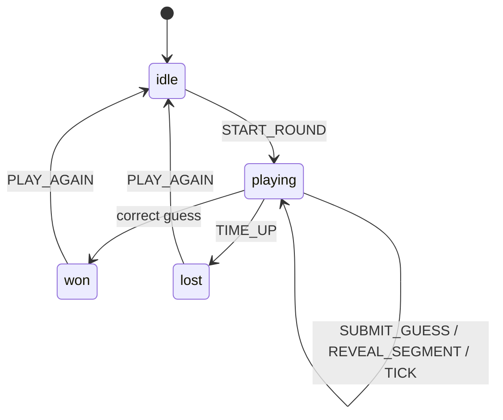

# feat: Cap-Locks V1 — 14-Segment Word Guessing Game

## Overview

Build the V1 single-player core loop of Cap-Locks: a word-guessing game where characters are rendered as 14-segment LED displays that progressively illuminate on a timer. Players guess the full word while watching segments reveal, receiving Wordle-style green/yellow feedback. Retro hardware aesthetic (amber LEDs, dark panel). Next.js on Vercel, entirely client-side, hardcoded word list.

## Problem Frame

Word games dominate casual gaming but their visual mechanics are stale. Cap-Locks introduces a novel reveal mechanic — 14-segment LED characters that gradually light up — creating a visual decoding challenge layered on word guessing. V1 validates whether this mechanic is fun in solo play before investing in live multiplayer infrastructure. (see origin: `docs/brainstorms/cap-locks-game-requirements.md`)

## Requirements Trace

- R1. 14-segment LED display rendering (A-Z, 0-9)
- R2. Dim segment outlines for unguessed characters
- R3. Time-based progressive segment drip
- R4. Drip pacing: tease early, readable late
- R5. Green display for correctly guessed letters
- R6. Retro hardware aesthetic (amber/red glow, dark background)
- R7. Full-word text input, case-insensitive
- R8. Unlimited guesses within timer
- R9. Green feedback: correct letter + position
- R10. Yellow feedback: correct letter, wrong position
- R11. No feedback for absent letters
- R11a. Duplicate letter handling (greens first, then yellows)
- R12. Visible guess history
- R13. Theme/category hint per word
- R14. 60-second round timer
- R15. Varying word lengths in curated list
- R16. Full word reveal animation on time-up
- R17. Track solve time
- R18. Track guess count
- R19. Results display at round end
- R20. Reject wrong-length guesses

## Scope Boundaries

- Single-player only — no multiplayer, accounts, or leaderboards
- Hardcoded word list in JavaScript — no database or CMS
- No dictionary validation — any string of correct length is accepted (V1 simplicity)
- No social sharing
- No V2-specific abstractions (real-time sync, server-authoritative state, anti-cheat)

## Context & Research

### Relevant Code and Patterns

Greenfield project — no existing codebase.

### External References

- **LED-Segment-ASCII** (GitHub: dmadison/LED-Segment-ASCII) — Complete 14-segment hex bitmask encoding for A-Z, 0-9. MIT licensed. Use as the character map data source.
- **14-segment display** (Wikipedia) — Segment layout reference. Segments labeled A-N with G split into G1/G2.
- **SVG glow technique** — Layered `feGaussianBlur` + `feColorMatrix` + `feMerge` filters for bloom effect.
- **Next.js App Router** — Server Component shell + `'use client'` game component pattern. `useReducer` for state.
- **requestAnimationFrame timer** — Wall-clock-anchored countdown (Date.now() delta) avoids setInterval drift and survives background tabs.
- **Mobile viewport** — `100dvh` + `interactive-widget=resizes-content` meta tag for keyboard-aware layout.

## Key Technical Decisions

- **Inline SVG with `<polygon>` per segment** (not Canvas or CSS): SVG gives individual segment control via props (fill, opacity, filter), resolution independence on all screens, GPU-composited opacity transitions for 60fps animation, and native React state binding. Canvas would require a manual repaint loop and lose CSS transitions. CSS clip-path is brittle for diagonal segments.

- **Hex bitmask character map**: Each character maps to a 16-bit integer where bits 0-13 represent segments A-N. Checking if segment `i` is active is a single bitwise AND. Data sourced from LED-Segment-ASCII.

- **SVG filters for glow, applied at `<g>` level**: Layered feGaussianBlur creates inner (tight) and outer (soft) glow. Applying to the character group (not per-segment) is critical for mobile performance — 14 individual filter operations per character would be too expensive.

- **`useReducer` for game state** (not Zustand/Jotai): Game state is a single cohesive object with clear transitions (START_ROUND, SUBMIT_GUESS, TICK, REVEAL_SEGMENT, TIME_UP). Zero dependencies. The pure reducer is trivially testable and gives a clean audit trail for V2 migration.

- **`requestAnimationFrame` + `Date.now()` for timing** (not setInterval): No drift, segment reveal schedule computed from elapsed time rather than counting ticks. **Background tab handling:** Use the Page Visibility API (`document.visibilitychange`) to pause the timer and reveal schedule when the tab is hidden, and resume by shifting the start time forward by the hidden duration. This prevents bulk segment reveals when switching back to the tab.

- **App Router with client boundary at Game component**: Root layout and page are Server Components (zero client JS for the shell). Only `Game.tsx` and its children are client components. Word list imported in the Server Component and passed as a prop — serialized into the RSC payload at build time.

- **Accelerating drip curve**: Reveal less-informative segments first (diagonals, center verticals), save character-defining segments (horizontals A/D, outer verticals B/C/E/F) for later. Non-linear timing — slow start, accelerating toward the end. This maximizes the tension curve: early reveals are tantalizing but ambiguous; late reveals make letters snap into focus.

- **Drip continues on green-locked positions**: The drip schedule is deterministic and fixed per word — it does not skip or redistribute when a letter is guessed correctly. Green-locked letters are already fully lit, so the drip has no visual effect on them. This keeps the mechanic simple and V2-sync-compatible.

- **Yellow feedback shown on guess history rows** (not on the main display): The main 14-segment display shows only three states: dim (unrevealed), amber (revealed by drip), and green (confirmed correct). Yellow indicators appear on the guess history list, color-coding each letter of the submitted word. This keeps the display clean and avoids visual overload.

- **No dictionary validation in V1**: Accept any string matching the target word length. Simplifies implementation (no dictionary dependency) and is acceptable for single-player. Brute-force guessing is self-limiting — typing takes time, and the 60s timer provides natural constraint.

- **Standard Vercel deployment** (not static export): Static export disables `next/image`, middleware, and Route Handlers. Standard deployment still serves statically from CDN (pages are generated at build time) but preserves optionality for V2 server features.

## Open Questions

### Resolved During Planning

- **Rendering approach (R1)**: Inline SVG with polygon paths — best for per-segment control, CSS transitions, and mobile performance.
- **Drip pacing (R3, R4)**: Accelerating curve. Reveal ~2-3 segments in first 20s, ~4-5 in next 20s, remainder in final 20s. Start with diagonals/center, end with horizontals/outer verticals.
- **Yellow feedback placement (R10)**: On the guess history rows, not the main display.
- **Guess history UI (R12)**: Scrollable list below the display. Hidden on mobile when keyboard is open (display + input take priority).
- **Green-locked letter interaction with drip**: Drip continues on fixed schedule; green letters are already fully lit so drip is visually no-op on them.

### Deferred to Implementation

- **Exact segment polygon coordinates**: The 14 polygon `points` arrays for a 100x160 viewBox need to be authored by hand or traced from a reference. This is geometry work best done during implementation.
- **LED-Segment-ASCII bitmask vendoring**: Copy the hex character map directly into `segments.ts` as a TypeScript const rather than importing as a runtime dependency. Document the bit-to-segment index mapping inline so polygon ordering is verifiable against it.
- **Exact reveal schedule per word length**: The accelerating curve parameters need playtesting. Start with a reasonable default and iterate.
- **Word list curation**: Theme selection, word difficulty, and visual distinguishability on the 14-segment display need creative judgment during implementation.
- **Victory/time-up animation specifics**: Exact animation choreography (duration, easing, effects) is best tuned visually.

## High-Level Technical Design

> *This illustrates the intended approach and is directional guidance for review, not implementation specification. The implementing agent should treat it as context, not code to reproduce.*

```
app/
  layout.tsx              — Server Component: HTML shell, fonts, viewport meta, dark bg
  page.tsx                — Server Component: imports Game, passes wordList prop
  globals.css             — Dark theme, LED glow keyframes, scanline overlay
  components/
    Game.tsx              — 'use client': useReducer game state, orchestrates all child components
    SegmentDisplay.tsx    — SVG 14-segment character component (single letter)
    WordDisplay.tsx       — Row of SegmentDisplay components for the full word
    GuessInput.tsx        — Text input with length validation
    GuessHistory.tsx      — Scrollable list of past guesses with green/yellow/gray coloring
    Timer.tsx             — Countdown display (rAF-based)
    ResultsScreen.tsx     — End-of-round: solve time, guess count, revealed word, Play Again
  lib/
    segments.ts           — 14-segment hex character map, segment geometry (polygon points)
    game-logic.ts         — Guess evaluation (green/yellow/none), duplicate handling
    reveal-schedule.ts    — Drip schedule builder: which segments reveal at which elapsed time
    words.ts              — Hardcoded word list with themes
  hooks/
    useCountdown.ts       — rAF + Date.now() countdown hook
    useRevealSchedule.ts  — Drives segment reveal state from elapsed time
```

**Game state machine:**



## Implementation Units

- [ ] **Unit 1: Project Scaffold and Layout**

**Goal:** Initialize the Next.js project with App Router, establish the dark-themed shell, and configure for Vercel deployment.

**Requirements:** R6 (retro aesthetic foundation)

**Dependencies:** None

**Files:**
- Create: `app/layout.tsx`
- Create: `app/page.tsx`
- Create: `app/globals.css`
- Create: `next.config.ts`
- Create: `tsconfig.json`
- Create: `package.json`

**Approach:**
- `npx create-next-app@latest` with App Router, TypeScript, Tailwind (optional — could use vanilla CSS for the retro feel)
- Root layout: dark background (#0a0a0a), system font or a monospace font that fits the retro aesthetic
- Viewport meta with `interactive-widget=resizes-content` for mobile keyboard handling
- Page uses `100dvh` flex column layout
- `page.tsx` is a Server Component that will later import Game and pass word list

**Patterns to follow:**
- Next.js App Router conventions (layout.tsx, page.tsx in app/)

**Test expectation:** none — pure scaffolding with no behavioral logic

**Verification:**
- `npm run dev` serves a dark-themed page
- `npm run build` succeeds with no errors
- Viewport fills the screen on mobile simulator

---

- [ ] **Unit 2: 14-Segment Display Component**

**Goal:** Build the core SVG component that renders a single 14-segment character with individual segment control.

**Requirements:** R1, R2, R5, R6

**Dependencies:** Unit 1

**Files:**
- Create: `app/components/SegmentDisplay.tsx`
- Create: `app/lib/segments.ts`
- Test: `__tests__/segments.test.ts`

**Approach:**
- `segments.ts`: Define the hex bitmask character map (A-Z, 0-9) sourced from LED-Segment-ASCII. Define the 14 polygon coordinate arrays for a viewBox of `0 0 100 180`. Export helper `isSegmentOn(charCode, segIndex)`.
- `SegmentDisplay.tsx`: Accepts props for target character, an array of 14 booleans for which segments are currently revealed, and a display state (dim/amber/green). Renders an SVG with 14 `<polygon>` elements. Each polygon's fill and opacity are driven by the revealed state and display state.
- SVG `<defs>` block with glow filters: amber-glow and green-glow using layered feGaussianBlur + feColorMatrix + feMerge. Apply filter at `<g>` level.
- Dim segments: fill #2a1a0a, opacity 0.08 (visible outline for counting).
- Revealed segments: fill #ff9500 (amber), opacity 1, with amber-glow filter.
- Green segments: fill #00e676, opacity 1, with green-glow filter.
- CSS transitions on opacity (0.4s ease-out) and fill (0.3s ease) for smooth reveals.

**Patterns to follow:**
- Standard React SVG component pattern (inline SVG in JSX)

**Test scenarios:**
- Happy path: Rendering character 'A' with all segments revealed produces 14 polygon elements, with the correct subset having amber fill (segments that compose 'A' per the hex map)
- Happy path: Rendering character 'A' with no segments revealed produces 14 polygons all in dim state
- Happy path: Rendering in green state produces green fill color on revealed segments
- Edge case: Rendering character '0' (digit) correctly maps to its bitmask segments
- Edge case: Partial reveal — revealing only 3 of 14 segments shows 3 lit + 11 dim
- Integration: `isSegmentOn` helper returns correct boolean for known character/segment combinations

**Verification:**
- A single SegmentDisplay renders a recognizable letter on screen
- Segments glow with amber LED effect on dark background
- Green state is visually distinct from amber

---

- [ ] **Unit 3: Word Display and Reveal Engine**

**Goal:** Build the full-word display (row of segment characters) and the time-based drip reveal system that progressively illuminates segments.

**Requirements:** R2, R3, R4, R14

**Dependencies:** Unit 2

**Files:**
- Create: `app/components/WordDisplay.tsx`
- Create: `app/lib/reveal-schedule.ts`
- Create: `app/hooks/useRevealSchedule.ts`
- Test: `__tests__/reveal-schedule.test.ts`

**Approach:**
- `reveal-schedule.ts`: Given a target word and round duration (60s), build a reveal schedule — an array of `[timeMs, charIndex, segmentIndex]` tuples. Algorithm:
  1. For each character, determine which segments are active (from the hex map)
  2. Classify segments into tiers: tier 1 (diagonals J, K, L, M, center H, N — least informative), tier 2 (G1, G2 — middle), tier 3 (A, B, C, D, E, F — most character-defining)
  3. Shuffle within each tier, then concatenate: tier 1 first, tier 3 last
  4. Distribute across the 60s timeline with an accelerating curve — first 40% of time reveals ~25% of segments, last 30% reveals ~50%
  5. Schedule is deterministic per word (same word always produces same reveal order)
- `useRevealSchedule.ts`: Hook that takes the schedule and uses `requestAnimationFrame` + `Date.now()` to compute which segments should be revealed at the current elapsed time. Returns a 2D boolean array `[charIndex][segmentIndex]`.
- `WordDisplay.tsx`: Renders a row of `SegmentDisplay` components, one per character. Passes the revealed-segment booleans and display state (dim/amber/green) per character.

**Patterns to follow:**
- rAF + Date.now() wall-clock pattern for drift-free timing

**Test scenarios:**
- Happy path: `buildRevealSchedule('CAT', 60000)` returns a schedule array covering all active segments across 3 characters
- Happy path: Schedule entries are sorted by time ascending
- Happy path: All active segments for each character appear exactly once in the schedule
- Edge case: Character 'I' (few active segments) has fewer schedule entries than 'W' (many active segments)
- Edge case: No segment is scheduled before time 0 or after the round duration
- Integration: Tier ordering — for any character, tier 1 segments (diagonals) appear earlier in the schedule than tier 3 segments (horizontals/outer verticals)
- Edge case: The schedule is deterministic — calling with the same word and duration produces identical output

**Verification:**
- Rendering a 5-letter word shows 5 dim character outlines
- Over 60 seconds, segments progressively light up across all characters
- Early reveals are ambiguous; late reveals make letters recognizable
- The reveal looks the same every time for the same word

---

- [ ] **Unit 4: Game State and Logic**

**Goal:** Implement the game state machine (useReducer) and guess evaluation logic with green/yellow/none feedback and duplicate letter handling.

**Requirements:** R7, R8, R9, R10, R11, R11a, R17, R18, R20

**Dependencies:** Unit 3

**Files:**
- Create: `app/components/Game.tsx` (initial version — state only, UI in Unit 5)
- Create: `app/lib/game-logic.ts`
- Test: `__tests__/game-logic.test.ts`

**Approach:**
- `game-logic.ts`: Pure function `evaluateGuess(guess: string, target: string) → LetterFeedback[]` where LetterFeedback is `'correct' | 'present' | 'absent'`. Algorithm: first pass marks greens (exact match), second pass marks yellows (present but unmatched), remainder is absent. This handles duplicates correctly per R11a.
- `Game.tsx`: `useReducer` with the state machine described in the technical design section. Actions: START_ROUND (pick word, reset state), SUBMIT_GUESS (evaluate, check win), TICK (update time remaining), REVEAL_SEGMENT (from the schedule hook), TIME_UP (end round), PLAY_AGAIN (reset to idle, pick new word). Word selection: random from the word list, avoiding the most recently played word.
- Guess validation: normalize to uppercase, reject if length doesn't match target (R20).

**Patterns to follow:**
- Pure reducer function pattern — all game transitions in one place

**Test scenarios:**
- Happy path: `evaluateGuess('CRANE', 'CRANE')` → all 'correct'
- Happy path: `evaluateGuess('CRANE', 'REACT')` → C:present, R:present, A:present, N:absent, E:present
- Edge case (duplicates): `evaluateGuess('PAPER', 'APPLE')` → P:present, A:present, P:correct, E:present, R:absent (first P is present because there's one unmatched P; third position P is green; second P would be excess)
- Edge case (duplicates): `evaluateGuess('LLAMA', 'LLAMA')` → all 'correct'
- Edge case (duplicates): `evaluateGuess('AABBB', 'ABCDE')` → A:correct, A:absent, B:absent, B:present, B:absent
- Edge case: Wrong-length guess is rejected (reducer returns unchanged state with an error flag)
- Happy path: Submitting the correct word transitions phase to 'won' and records solve time
- Happy path: TIME_UP action transitions phase to 'lost'
- Happy path: PLAY_AGAIN resets phase to 'idle'
- Integration: Guess count increments on each valid SUBMIT_GUESS

**Verification:**
- Game state transitions cleanly between idle → playing → won/lost → idle
- Feedback colors match expected green/yellow/absent for various test words
- Duplicate letters follow the Wordle-standard algorithm

---

- [ ] **Unit 5: Game UI and Interaction**

**Goal:** Build all the interactive UI components: text input, guess history with color-coded feedback, countdown timer display, theme hint, and wire everything together in the Game component.

**Requirements:** R7, R10, R12, R13, R14, R19

**Dependencies:** Unit 4

**Files:**
- Modify: `app/components/Game.tsx` (add UI rendering)
- Create: `app/components/GuessInput.tsx`
- Create: `app/components/GuessHistory.tsx`
- Create: `app/components/Timer.tsx`
- Create: `app/components/ResultsScreen.tsx`
- Create: `app/hooks/useCountdown.ts`
- Modify: `app/page.tsx` (import Game, pass wordList)
- Test: `__tests__/useCountdown.test.ts`

**Approach:**
- **Layout (top to bottom):** Theme hint → WordDisplay → Timer → GuessInput → GuessHistory. On mobile with keyboard open, GuessHistory hides to keep display + input visible.
- **GuessInput.tsx:** Text input, `inputMode="text"`, `autoComplete="off"`. Filter input to A-Z only (strip non-letter characters before submission). Enforces max length matching target word. Shows a shake animation on wrong-length submit (R20). Clears after each submission. Auto-focused on round start.
- **GuessHistory.tsx:** Scrollable list of past guesses. Each guess is a row of letter tiles. Each tile is color-coded: green (#00e676), yellow/amber (#ffb300), gray (#4a4a4a) based on feedback. Most recent guess at the top.
- **Timer.tsx:** Displays seconds remaining. Large, prominent, retro-styled. Color shifts to red in final 10 seconds.
- **ResultsScreen.tsx:** Shown after win or time-up. Displays: outcome (win/lose), solve time (if won), guess count, the revealed word. "Play Again" button to start a new round.
- **useCountdown.ts:** rAF-based hook. Records start time, computes remaining on each frame. Only triggers re-render when displayed second changes. Calls onExpire callback when time hits 0. Pauses on `visibilitychange` (hidden) and resumes by adjusting start time when tab returns to foreground.
- **Mobile layout:** Flex column with `100dvh`. Display area shrinks (min-height 120px) when keyboard opens. Input area has `env(safe-area-inset-bottom)` padding.

**Patterns to follow:**
- `dvh` + `interactive-widget=resizes-content` pattern for mobile keyboard
- VisualViewport API as fallback for older browsers

**Test scenarios:**
- Happy path: useCountdown hook counts from 60000ms to 0, fires onExpire at 0
- Edge case: useCountdown survives simulated background tab (uses Date.now, not interval counting)
- Happy path: Submitting a guess via the input clears the input field and adds the guess to history
- Edge case: Submitting an empty string or wrong-length string shows rejection indicator and does not add to history
- Happy path: Guess history shows correct green/yellow/gray coloring per feedback
- Happy path: Results screen shows after win with solve time and guess count
- Happy path: Results screen shows after time-up with the revealed word
- Integration: "Play Again" button starts a new round with a different word

**Verification:**
- Full game is playable from start to finish — guess words, see feedback, win or lose, play again
- Timer counts down visually and expires correctly
- Mobile viewport handles keyboard appearance without breaking the display
- Guess history scrolls and shows correct color feedback

---

- [ ] **Unit 6: Word List and Content**

**Goal:** Create a curated word list of 80-100 words across 6-8 theme categories with varying word lengths.

**Requirements:** R13, R15

**Dependencies:** Unit 1

**Files:**
- Create: `app/lib/words.ts`

**Approach:**
- Export a typed array of `{ word: string; theme: string }` objects.
- Themes: Animals, Food, Space, Music, Sports, Movies, Nature, Technology (or similar).
- Word lengths: Mix of 4, 5, 6, 7, and 8 letter words.
- Word selection criteria: common enough that most English speakers know them, but not so obvious that no guessing is needed. Avoid words that look identical in partial 14-segment reveal (e.g., two words that share most of the same segments in the same positions).
- All words uppercase, A-Z only (no numbers, hyphens, or spaces).

**Patterns to follow:**
- Simple TypeScript constant export

**Test expectation:** none — pure content data with no behavioral logic. Validation that all words are A-Z uppercase and lengths are 4-8 can be done as a lint-style check during implementation.

**Verification:**
- Word list contains 80-100 entries
- Each entry has a word and a theme
- Words span at least 3 different lengths

---

- [ ] **Unit 7: Visual Polish and Retro Aesthetic**

**Goal:** Apply the retro hardware aesthetic: amber LED glow effects, panel styling, subtle flicker, scanline overlay, and round transition animations.

**Requirements:** R6, R16

**Dependencies:** Units 2, 5

**Files:**
- Modify: `app/globals.css`
- Modify: `app/components/SegmentDisplay.tsx` (refine glow filter parameters)
- Modify: `app/components/WordDisplay.tsx` (add flicker, panel container)
- Modify: `app/components/ResultsScreen.tsx` (add victory/defeat animation)

**Approach:**
- **Panel container:** Dark background (#0a0a0a) with subtle border/bezel to simulate vintage instrument housing. Rounded corners on the panel, not on individual characters.
- **Glow refinement:** Tune feGaussianBlur stdDeviation values. Inner glow stdDeviation ~2, outer glow ~6. Reduce outer glow on mobile via media query for performance.
- **Subtle flicker:** CSS keyframe animation on each character with staggered durations (7s, 8s, 9s) to avoid synchronized flicker. Very subtle — 85-100% opacity range.
- **Scanline overlay:** CSS `::after` pseudo-element with repeating-linear-gradient. Semi-transparent horizontal lines at 4px intervals. `pointer-events: none`.
- **Time-up reveal (R16):** When time expires, rapidly illuminate all remaining segments with a cascade animation (left to right, 100ms stagger per character).
- **Victory animation:** Green pulse on the full word display, brief celebratory effect.
- **`prefers-reduced-motion`:** Disable flicker and reduce glow animation for accessibility.

**Patterns to follow:**
- CSS keyframe patterns for flicker effects
- `@media (prefers-reduced-motion: reduce)` for accessibility

**Test expectation:** none — visual styling with no behavioral logic. Verification is visual inspection.

**Verification:**
- Display glows with warm amber on dark background
- Subtle flicker is noticeable but not distracting
- Scanlines are visible up close but don't interfere with readability
- Time-up reveal animation cascades satisfyingly
- `prefers-reduced-motion` disables flicker and pulse effects

## System-Wide Impact

- **Interaction graph:** Game.tsx orchestrates all child components via props and useReducer dispatch. No global state, no context providers needed for V1. The reveal schedule hook reads from the same Date.now() clock as the countdown hook.
- **Error propagation:** Minimal — client-side only. Invalid guesses are rejected at the reducer level, not thrown as errors. No network calls in V1.
- **State lifecycle risks:** None significant. All state lives in the Game component's useReducer. Page refresh resets the game (acceptable for V1).
- **API surface parity:** N/A for V1.
- **Integration coverage:** The key cross-layer interaction is between the reveal schedule (time-based) and the game state (guess-based green feedback). When a letter is guessed correctly, it transitions to green regardless of the drip state. Both systems read the same wall clock.
- **Unchanged invariants:** No existing systems are affected (greenfield).

## Risks & Dependencies

| Risk | Mitigation |
|------|------------|
| 14-segment polygon geometry is tedious and error-prone | Author from reference image, validate each letter visually. This is a one-time cost. |
| SVG glow filter performance on low-end mobile | Apply filter at `<g>` level, reduce stdDeviation on mobile, test on real devices early |
| Drip pacing feels wrong (too fast/slow, wrong tension curve) | Make the reveal schedule configurable (parameters in reveal-schedule.ts). Iterate during implementation. |
| Mobile keyboard obscures the display | Use `dvh` + `interactive-widget=resizes-content`, hide guess history when keyboard is open, test on real mobile early |
| Word list is trivially inspectable in client source | Acknowledged V1 limitation. Acceptable for single-player validation. V2 moves word serving to the server. |
| 50-100 words exhausted quickly by returning players | Sufficient for V1 mechanic validation. V2 adds a larger word database. |

## Sources & References

- **Origin document:** [docs/brainstorms/cap-locks-game-requirements.md](docs/brainstorms/cap-locks-game-requirements.md)
- **LED-Segment-ASCII** — Character map hex bitmasks (GitHub: dmadison/LED-Segment-ASCII, MIT)
- **14-segment display layout** — Wikipedia: Fourteen-segment display
- **SVG glow filters** — 9elements: Creating an animated SVG Neon light effect
- **CSS neon text** — CSS-Tricks: How to Create Neon Text With CSS
- **Next.js App Router** — Next.js v16 Server and Client Components docs
- **Mobile viewport units** — dvh + interactive-widget=resizes-content pattern
- **rAF timer pattern** — Wall-clock-anchored countdown avoiding setInterval drift
